# Clasificacion_de_clientes_webapp_shiny
Creacción de una aplicación web utilizando programación reactiva con Shiny webapp de Rstudio

En esta oportunidad comparto el desarrollo de una aplicación web con programación reactiva utilizando el paquete Shiny WebApp de Rstudio, 
el modelo de clasificación implementado en la aplicación, así como su diseño, concepción, desarrollo, pruebas y validación se encuentran ya descritos
y explicados en el proyecto que lleva por nombre <a href=https://github.com/suarezcode/Clasificacion-de-clientes-por-tiempos-de-pago>Clasificación de clientes por tiempos de pago</a>,
el <a href=https://github.com/suarezcode/Clasificacion-de-clientes-por-tiempos-de-pago>link</a> anterior les llevará al repositorio del proyecto.

El proceso de desarrollo de la aplicación puede dividirse en las siguientes etapas:

## 1. Creación de la Aplicación Shiny Web App

Para crear una aplicación shiny debemos descargar e instalar previamente el paquete shiny, posterirmente en el menú principal seleccionamos la opción de crear un nuevo archivo 
Shiny web app:

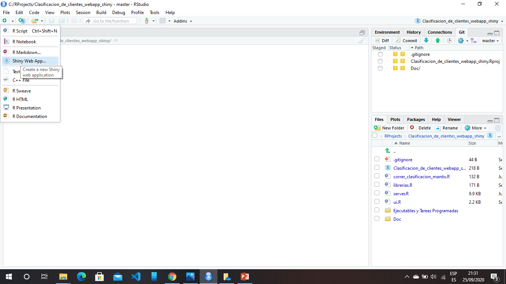

   
1.1. Asignamos un nombre a la aplicación: 

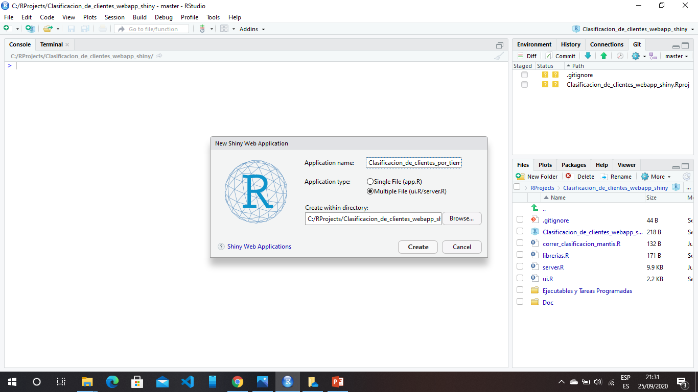

    
1.2. Rstudio automáticamente genera dos archivos, server.R y ui.r:

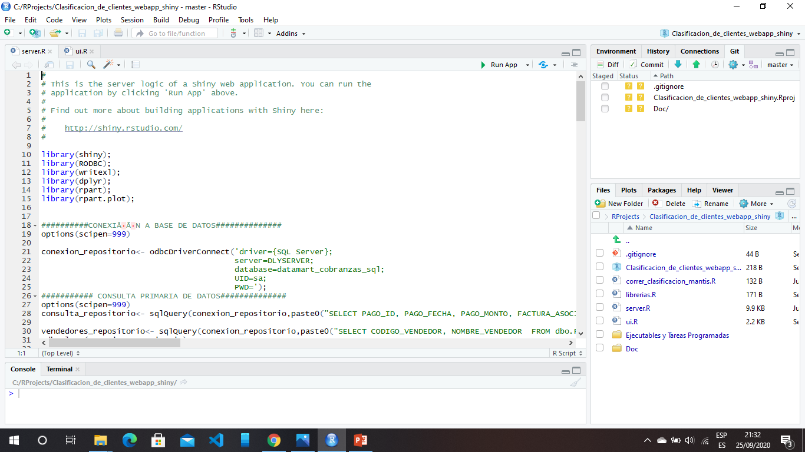

  

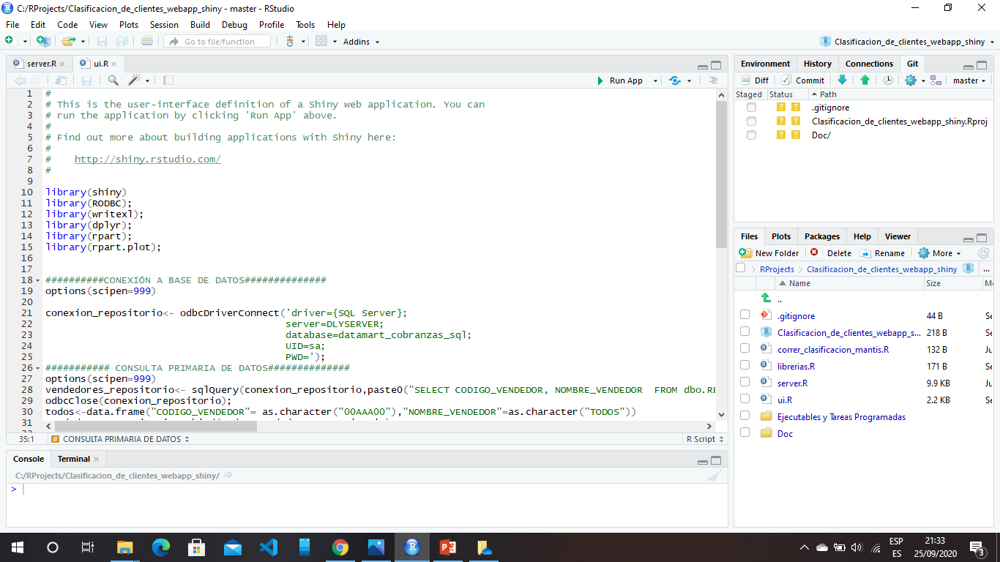

 
1.3. En al archivo server.R escribimos el código para generar el modelo de clasificación, este correrá una vez, server.R constituye el "servidor" de la aplicación, el códgo incluye
la conexión con la base de datos para obtener los datos primarios, la construción de los datasets y la ejecución de las operacines del modelo propiamente dichas declaradas dentro
de una función con entradas y salidas, que a su vez está incluida dentro de la función shinyServer.
   

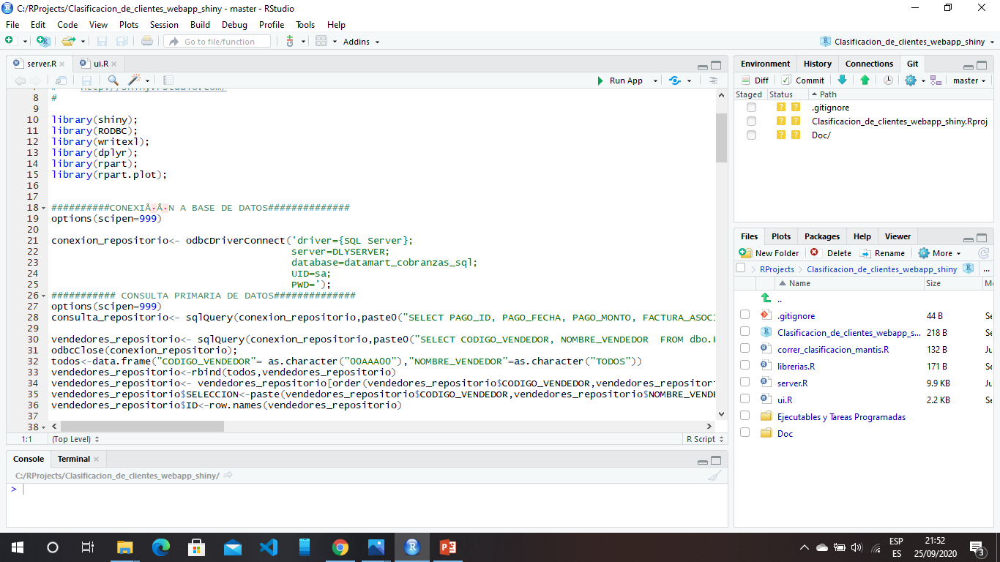

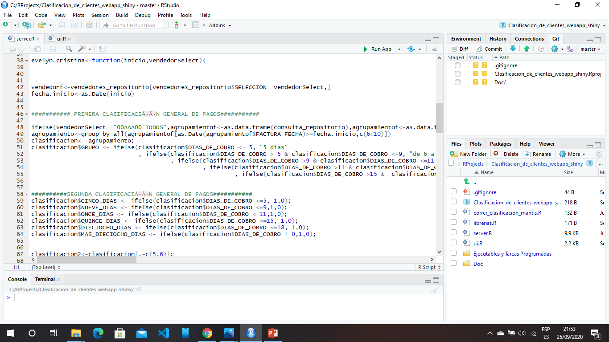

  
1.4 Por su parte el archivo ui.R (User Interface) como su nombre sugiere, representa el la interfaz de usuario para manipluar la aplicación, en este archivo se incluye el código
para generar widgets, plots, tablas y demás elementos que le permitiran al usuario manipular la aplicación y consumir la información
    

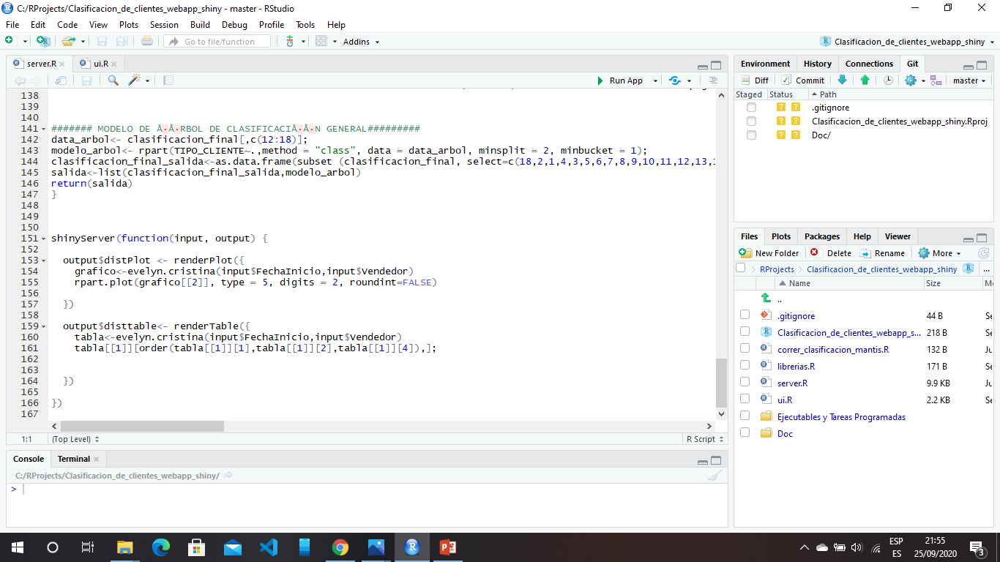

1.5. Por último, para hacer que la aplicación sea accesible desde cualquier equipo de la red, incluso desde internet (para ello se necesita un dominio), creamos el archivo 
correr_clasificacion_mantis.R el cual cuenta con la instrucción 
shiny::runApp('ruta', host = 'ipservidor', port = nºdepuerto) ->
shiny::runApp('C:\\Sistema Administrativo\\Sistema de Inventario\\Clasificacion_Clientes_Mantis', host = '10.30.1.100', port = 4040), este archivo servirá para levantar la 
aplicachión Shiny de forma automática con el Programador de Tareas de Windows el cual ejecutará un archivo BAT que hace referencia a correr_clasificacion_mantis.R

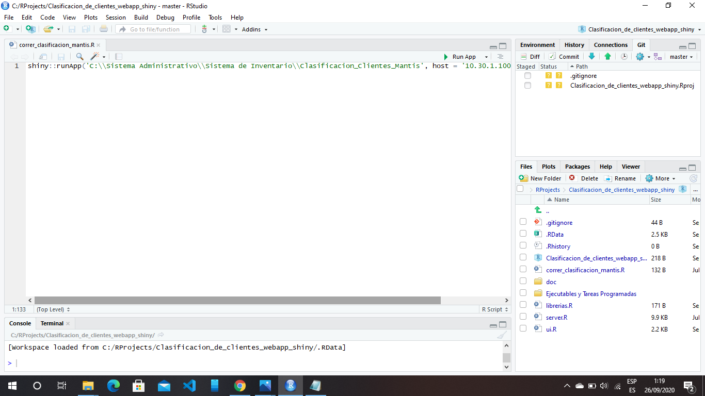

## 2. Creación de Archivos Ejecutables .BAT

Para correr la aplicación shiny de forma automática se crearon dos archivos .BAT que serán ejecutados por el Programador de Tareas de Windows, un archivo para iniciar la
la aplicación y otro para detenerla. Como la aplicación se alimenta de una Bodega de Datos que se actualiza diariamente mediante procesos de extracción, transformación y 
carga, entonces se hace necesario detener y reiniciar diariamente la aplicación shiny para actualizar los datos que utilizará el modelo de clasificación, también es necesario
incluir una tarea programada que inicie la aplicación al encender el servidor, para garantizar que el servicio se levente automáticamente en case de apagado o reinicio inesperado
del equipo.

El archivo .BAT para iniciar la aplicación contiene la siguiente instrucción:
 
 
CD "C:\Program Files\R\R-4.0.2\bin"
Rscript "C:\Sistema Administrativo\Sistema de Inventario\Clasificacion_Clientes_Mantis\correr_clasificacion_mantis.r"
 
 
Apertura de la carpeta bin en la ruta de instalación de R, ejecutar Rscript apuntando al archivo en R que creamos previamente llamado "correr_clasificacion_mantis.r"

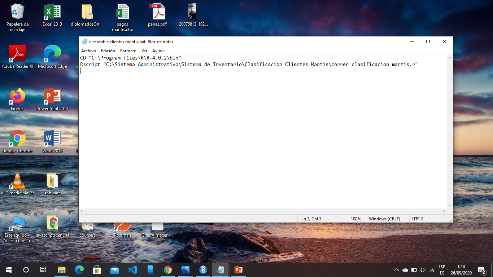

El archivo .BAT para detener los procesos del lenguaje R contiene la siguiente instrucción:
TASKKILL /F /IM Rscript.exe

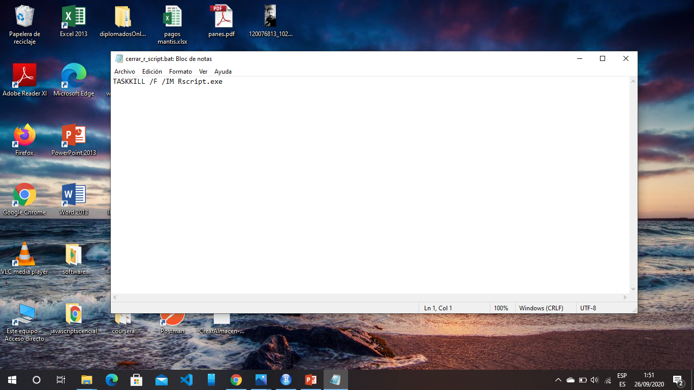

## 3. Crear tareas programadas en windows

Finalmente se crean las tareas programadas que ejecutarán los archivos .BAT de acuerdo a la programación u hora de actualización de la data, o de acuerdo a la conveniencia 
del administrador de la a aplicación

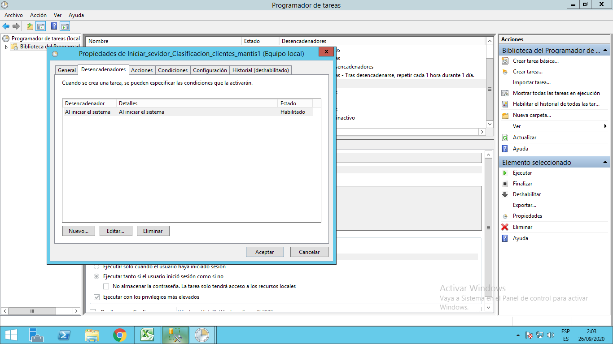

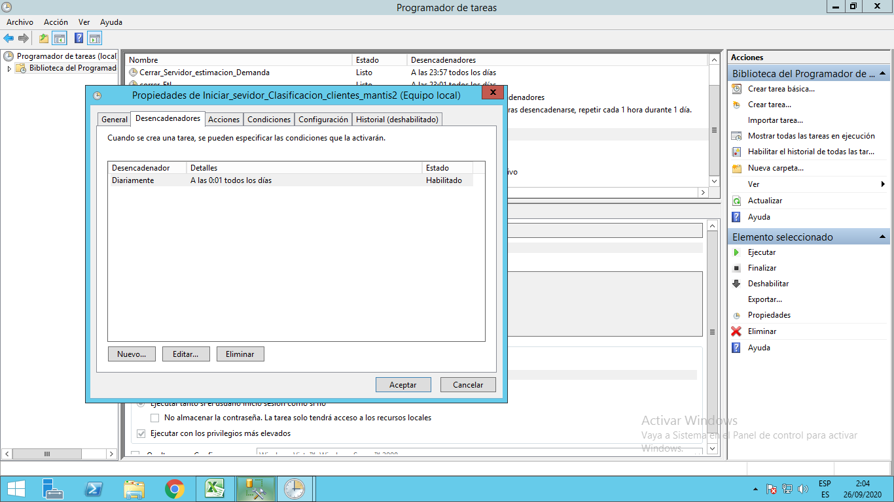

También es necesario habilitar en el firewall de windows el puerto por el cual se conectaran los diferentes equipos a la aplicación

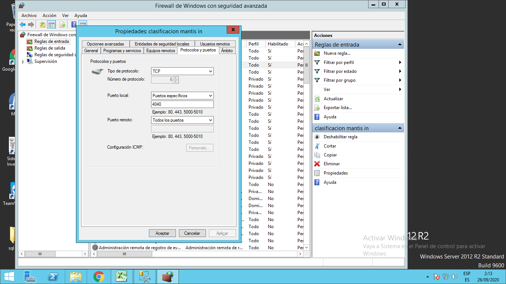

Si se han seguido los pasos correctamente entonces ya podemos conectarnos a nuestra aplicación incluso desde cualquier parte vía internet con una url

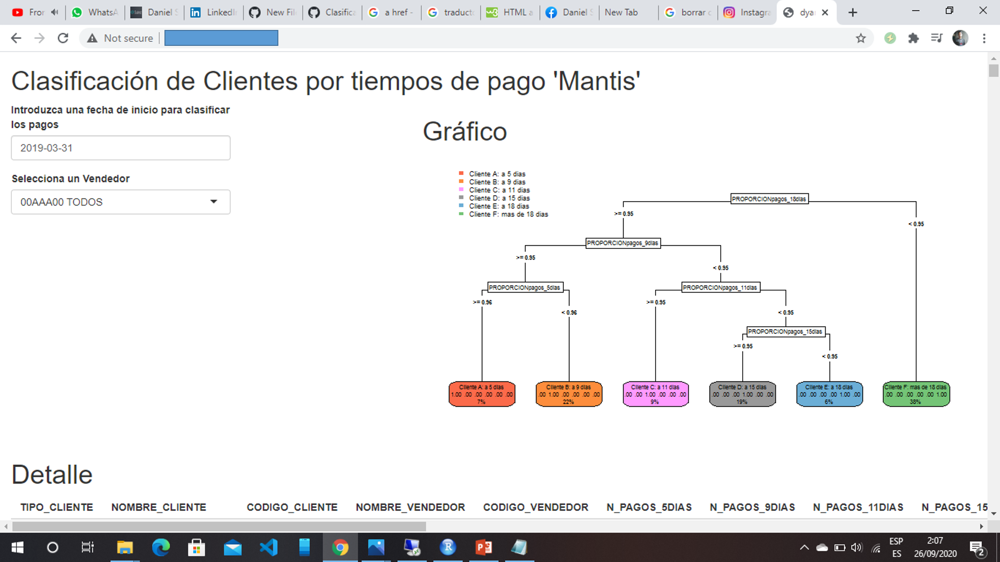

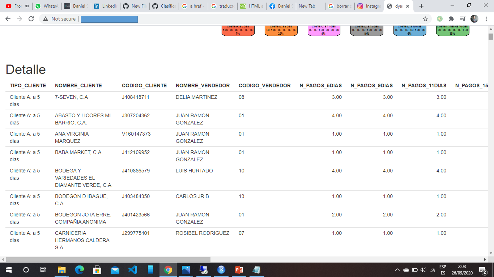

